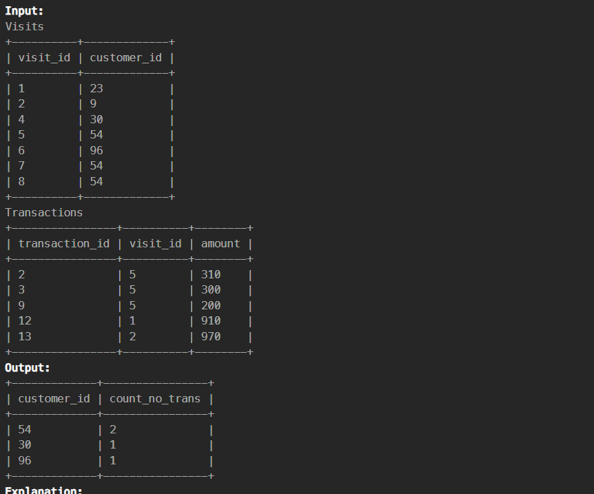

<h1 style='text-align: center;'>Leetcode SQL 50</h1>
<details>
  <summary> <b>Problem :1757. Recyclable and Low Fat Products </b></summary>

  [Problem Link](https://leetcode.com/problems/recyclable-and-low-fat-products/?envType=study-plan-v2&envId=top-sql-50) <br>
  


```sql
select product_id from Products where low_fats='Y' and recyclable='Y';

```

</details>


<details>
  <summary> <b>584. Find Customer Referee </b></summary>

  [Problem Link](https://leetcode.com/problems/find-customer-referee/?envType=study-plan-v2&envId=top-sql-50) <br>

  

```sql
#solve 1
select name from customer where referee_id is null or  referee_id!=2;
 #"<>" it also not equal to

#solve 2 
SELECT name FROM Customer WHERE IFNULL(referee_id,1) <> 2;
# IFNULL(referee_id,1) if referee_id is null return 1 or return referee_id
```
</details>


<details>
  <summary> <b>595. Big Countries </b></summary>

  [Problem Link](https://leetcode.com/problems/big-countries/description/?envType=study-plan-v2&envId=top-sql-50) <br>

  
  
```sql
#solve 1
 select name ,population , area from world where area>=3000000 or population>= 25000000;

#solve 2
select name, population, area from World where area>=3000000 
union 
select name, population, area from World where population>=25000000;
```
</details>

<details>
  <summary> <b> 1148. Article Views I </b>  </summary>

  [Problem Link](https://leetcode.com/problems/article-views-i/description/?envType=study-plan-v2&envId=top-sql-50) <br>

  
  
```sql
#solve 1
select distinct author_id as id from views where author_id=viewer_id order by id;

```
</details>

<details>
  <summary> <b> 1683. Invalid Tweets  </b>  </summary>

  [Problem Link](https://leetcode.com/problems/invalid-tweets/description/?envType=study-plan-v2&envId=top-sql-50) <br>

  
  
```sql
#solve 1
select tweet_id from Tweets where length(content) > 15;

#solve 2
select tweet_id from Tweets where char_length(content) > 15;

```
</details>


<details>
  <summary> <b> 1378. Replace Employee ID With The Unique Identifier  </b>  </summary>

  [Problem Link](https://leetcode.com/problems/replace-employee-id-with-the-unique-identifier/description/?envType=study-plan-v2&envId=top-sql-50) <br>

  
  
```sql
#solve 1
select EmployeeUNI.unique_id ,Employees.name from EmployeeUNI right join Employees on EmployeeUNI.id=Employees.id;

#solve 2
select 
eu.unique_id as unique_id, e.name as name
from Employees e left join EmployeeUNI eu on e.id = eu.id
# Rename table nanme
```
</details>

<details>
  <summary> <b> 1068. Product Sales Analysis I </b>  </summary>

  [Problem Link](https://leetcode.com/problems/product-sales-analysis-i/description/?envType=study-plan-v2&envId=top-sql-50) <br>

  
  
```sql
#solve 1
select pr.product_name,s.year,s.price from sales s left join product pr on s.product_id=pr.product_id;
#solve 2
```
</details>


<details>
  <summary> <b>1581. Customer Who Visited but Did Not Make Any Transactions  </b>  </summary>

  [Problem Link](https://leetcode.com/problems/customer-who-visited-but-did-not-make-any-transactions/description/?envType=study-plan-v2&envId=top-sql-50) <br>


  
```sql
SELECT v.customer_id, COUNT(v.visit_id) AS count_no_trans 
from Visits v 
LEFT JOIN Transactions t 
ON v.visit_id = t.visit_id  
WHERE t.transaction_id IS NULL 
GROUP BY v.customer_id; 


#UPDATE DEC 1ST : we take the t.amount as null
SELECT v.customer_id, COUNT(v.visit_id) AS count_no_trans 
from Visits v 
LEFT JOIN Transactions t 
ON v.visit_id = t.visit_id  
WHERE t.amount IS NULL 
GROUP BY v.customer_id;
```
</details>

<details>
  <summary> <b>  </b>  </summary>

  [Problem Link]() <br>

  
  
```sql
#solve 1
#solve 2
```
</details>

<details>
  <summary> <b>  </b>  </summary>

  [Problem Link]() <br>

  
  
```sql
#solve 1
#solve 2
```
</details>